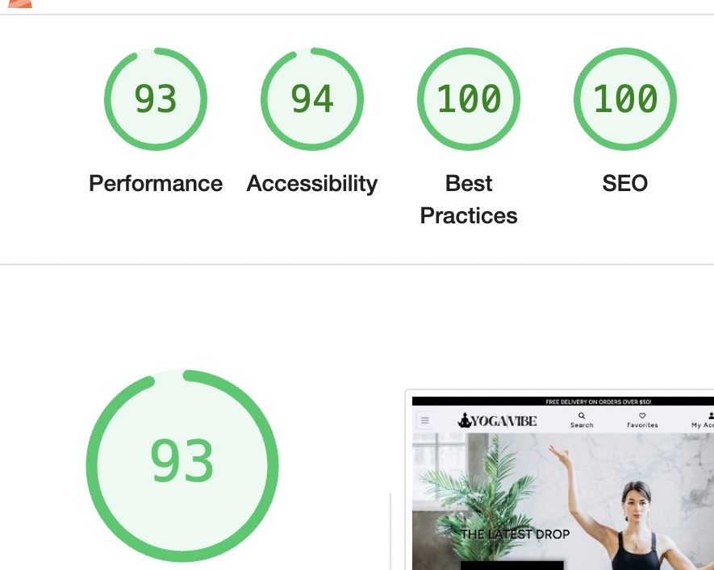
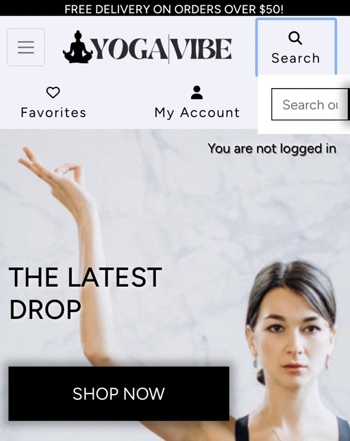
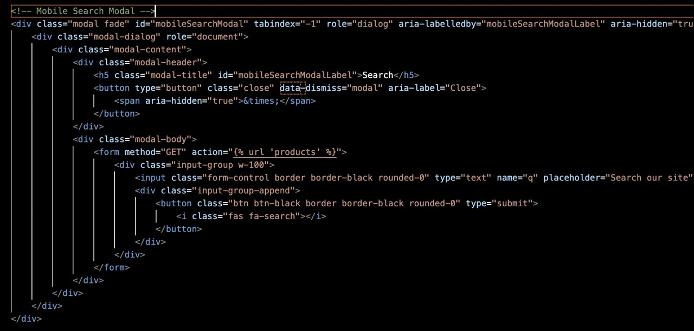
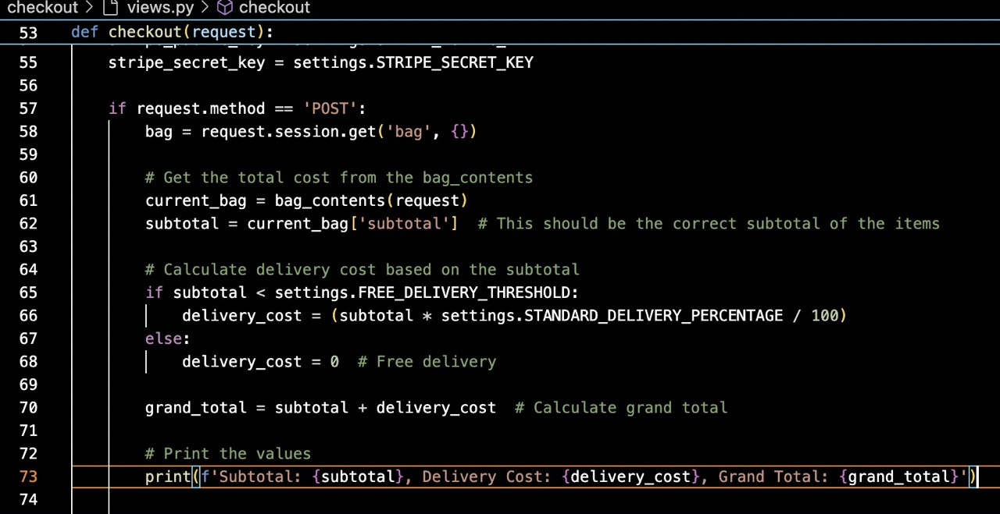
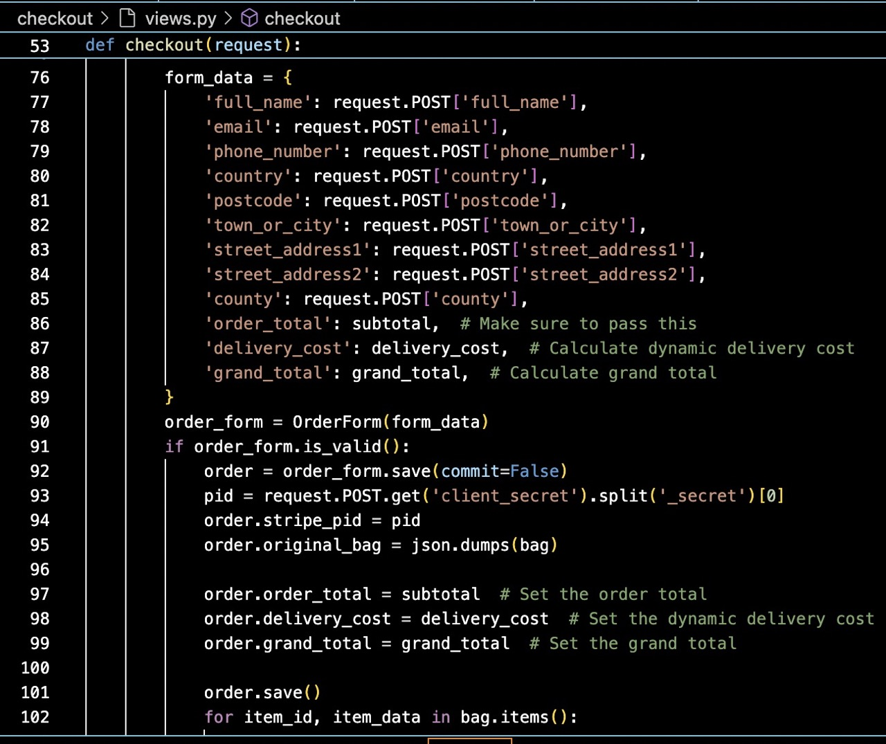
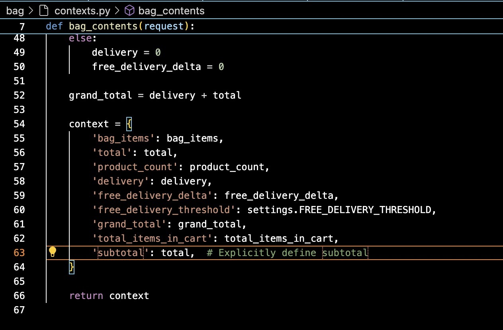

# YOGA VIBE TESTING & BUGS

Welcome to our B2C e-commerce platform, dedicated to providing high-quality yoga products for enthusiasts of all levels. Whether you're a seasoned practitioner or just beginning your yoga journey, our online store offers a variety of products to support your practice.

Visit the live site: [YogaVibe](https://yoga-vibe-p5.onrender.com/)  
(Updated link after redeploying on Render instead of Heroku)

# Table of Contents
* [User Story Testing](#user-story-testing)
  * [USER REGISTRATION	](#user-registration)
  * [POST/OPEN THREADS](#postopen-threads)
  * [MANAGE COMMENTS](#manage-comments)
  * [USER PROFILES](#user-profiles)
  * [EDIT / DELETE PROFILE](#edit--delete-profile)
  * [POST PAGINATION](#post-pagination)
* [AUTOMATED TESTING](#automated-testing)
  * [Python Linter](#python-linter)
  * [Lighthouse Scores](#lighthouse-scores)
    * [Home](#home-score)
    * [Post Detail](#post-detail-score)
    * [Profile](#profile-score)
  * [Jigsaw CSS Validator](#jigsaw-css-validator)
  * [W3 Html Validator](#w3-html-validator)
  * [JSHint Validator](#jshint-validator)
* [Manual Testing](#manual-testing)
  * [Full Testing](#full-testing)
* [BUG TRACKER](#bug-tracker)
  * [Solved Bugs](#solved-bugs)
  * [Unfixed Bugs](#unfixed-bugs)

 

[< Back to README](README.md)

## USER STORY TESTING

#### As a site user, I can view a list of products so that I can select some to purchase.

AC1 - When I navigate to the homepage of the e-commerce site, I should see a visually appealing and organized display of product categories.

* **Summary:** 
    When a user visits the website he can easily see the navigation menu with all the product categories.
     
       *By testing all these features, it can be affirmed that the user story is accomplished.* 

* **Outcome:** Pass 

AC2 - Upon selecting a specific category, I should be able to view a list of products within that category, with each product showing its name, price, and image.

* **Summary:** 
    When a user selects a category a page opens showing all the products in that category with each product showing the name, price and image.
     
       *By testing all these features, it can be affirmed that the user story is accomplished.* 

* **Outcome:** Pass 

AC3 - Each product listing should include a clickable link or button that allows me to view more detailed information about the product, such as description, specifications, and customer reviews etc.

* **Summary:** 
    When a user clicks a product it opens up a product detail page, displaying the products description, pricing, and reviews.
     
       *By testing all these features, it can be affirmed that the user story is accomplished.* 

* **Outcome:** Pass 

#### As a site user, I can register for a new account so that I can have a personal account and be able to view and edit my account.

AC1 - Easily login and logout to view and edit my personal information.

* **Summary:** 
    Users can login and logout smoothly with hints showing if any field is written incorrect. Upon logging in theres an option to edit and update there personal information in my profile page.
     
       *By testing all these features, it can be affirmed that the user story is accomplished.* 

* **Outcome:** Pass 

AC2 - Easily recover password to recover account if password is forgotten.

* **Summary:** 
    If user forgets password they can press the option that password has been forgotten and gets an email with a link to change there password.
     
       *By testing all these features, it can be affirmed that the user story is accomplished.* 

* **Outcome:** Pass 

AC3 - Receive an email confirmation after registation.

* **Summary:** 
    When a user registers they will receive a email telling them to confirm there registation.
     
       *By testing all these features, it can be affirmed that the user story is accomplished.* 

* **Outcome:** Pass 

#### As a site user, I can view and manage my user profile so that I can update my personal information and preferences.

AC1 - Upon logging into my account, I should be able to access my user profile page, which displays my current personal information such as name, email address, shipping address, and contact information.

* **Summary:** 
    Users can login and access there user profile by navigating to the my account on nav menu which opens up a dropdown with my profile in it. By going to my profile the user will be able to update there personal information.
     
       *By testing all these features, it can be affirmed that the user story is accomplished.* 

* **Outcome:** Pass 

AC2 - The user profile page should display a history of my past orders, including order dates, order numbers, items purchased, and order statuses (e.g., pending, shipped). I should be able to click on each order to view detailed information about the items ordered and their respective statuses.

* **Summary:** 
    My profile page displayes a list of pas order history if user has made any orders. All orders are clickable which will take them to that pas order confirmation.
     
       *By testing all these features, it can be affirmed that the user story is accomplished.* 

* **Outcome:** Pass 

AC3 - Within the profiles section, there should be a dedicated "Favorites" page where I can view a list of products I have marked as favorites. I should be able to add new products to my favorites list and remove existing ones as needed. The list of favorites should persist across sessions.

* **Summary:** 
    When user is logged in a favorite section will appear on navigation which will take them to there favorites page. If the user has favorited any products they will be displayed on this page. Theres also an option for removing from favorites. 
     
       *By testing all these features, it can be affirmed that the user story is accomplished.* 

* **Outcome:** Pass 

#### As a site user, I can leave reviews for products so that I can share my experience with other customers and help them make informed purchase decisions.

AC1 - As a logged-in user, when I navigate to the product details page, I should see a section where I can write a review for the product.

* **Summary:** 
    When user is logged in a button will appear underneath a product on the products detail page. When pressing this button a form will be opened in which the user can write a review for that specific product.
     
       *By testing all these features, it can be affirmed that the user story is accomplished.* 

* **Outcome:** Pass 

AC2 - As a site user, when i press write a review button and am not logged in i will be informed that i need to be logged in in order to leave a product review.

* **Summary:** 
    When users are not logged in there is instead of the button a text displaying that the user must log in to leave a review.
     
       *By testing all these features, it can be affirmed that the user story is accomplished.* 

* **Outcome:** Pass 

AC3 - After submitting a review, it should appear on the product page under the reviews section. The review should display my username, review text, rating, and the date it was submitted.

* **Summary:** 
    When review has been submitted the review display section updates to display the review written by that user. All fields appear as they are all required to fill in to leave a review. 
     
       *By testing all these features, it can be affirmed that the user story is accomplished.* 

* **Outcome:** Pass 

#### As an admin user, I want to have full CRUD functionality for products so that I can effortlessly maintain an up-to-date site and product information.

AC1 - As an admin user, I should be able to add new products to the store. The product creation form should include fields for product name, description, price, category, and image upload. Upon submission, the new product should appear immediately in the store's product listings.

* **Summary:** 
    As a logged in admin user you can add products to the store my going to my account 'manage products' which will open up add a product form with all relevan required fields.
     
       *By testing all these features, it can be affirmed that the user story is accomplished.* 

* **Outcome:** Pass 

AC2 - As an admin user, I should be able to edit existing product details. When I navigate to the product section, I should see a list of current products with an option to edit each product. The edit form should allow modification of product name, description, price, category, and image. Changes made should be reflected immediately in the product listings.

* **Summary:** 
    As a logged in admin user there will be displayed a clickable button beside all existing products. when this edit button is clidked a new page opens with the edit product form with all relevant fields required. All changes are immediate.
     
       *By testing all these features, it can be affirmed that the user story is accomplished.* 

* **Outcome:** Pass 

AC3 - As an admin user, I should be able to remove products from the store. There should be a delete option available next to each product in the product section. Upon deletion, the product should be permanently removed from the store.

* **Summary:** 
   As a logged in admin user i will see a delete button beside each existing product which will immedietly delete that specific product.
     
       *By testing all these features, it can be affirmed that the user story is accomplished.* 

* **Outcome:** Pass 

#### As a shopper, I want to be able to select products, add them to my cart, and complete the checkout process smoothly and securely.

AC1 - As a shopper, I should be able to browse products, view detailed information about each product, and add desired products to my shopping cart. The cart should update dynamically to reflect the added items.

* **Summary:** 
    As a site user you can view, add and update product to cart.
     
       *By testing all these features, it can be affirmed that the user story is accomplished.* 

* **Outcome:** Pass 

AC2 - From the shopping cart page, I should be able to view all products added, their quantities, and prices. I should have options to update quantities and remove products.

* **Summary:** 
    As a site user navigating to the shopping page all fields are visible as long as the user has added something to the cart. The option to update quantity is available on each product.
     
       *By testing all these features, it can be affirmed that the user story is accomplished.* 

* **Outcome:** Pass 

AC3 - After finalizing my product selection in the cart, I should be able to proceed to the checkout process. There should be a clear and visible "Checkout" button or link that initiates the checkout flow.

* **Summary:** 
   The checkout button is right underneath everything in the cart which will take you directly to checkout.
     
       *By testing all these features, it can be affirmed that the user story is accomplished.* 

* **Outcome:** Pass 

AC4 - Easily enter payment information

* **Summary:** 
   Payment information is quik and easy and error handling is functional.
     
       *By testing all these features, it can be affirmed that the user story is accomplished.* 

* **Outcome:** Pass 

AC5 - Upon successful completion of the checkout process, I should receive an order confirmation page and email that includes an order summary, and any other relevant information. The order should also be visible in my account's order history.

* **Summary:** 
   Upon successful checkout the user will get to order confirmation page. this order confirmation is also sent to there email.
     
       *By testing all these features, it can be affirmed that the user story is accomplished.* 

* **Outcome:** Pass 

#### As a site user, I can enter a keyword in the search field, so that I can view all products associated with that keyword

AC1 - When I navigate to the e-commerce site, there should be a clearly visible search field prominently displayed, such as in the header or a designated search bar area.

* **Summary:** 
    The search field is visible accross all sites on the website in the header.
     
       *By testing all these features, it can be affirmed that the user story is accomplished.* 

* **Outcome:** Pass 

AC2 - Upon entering a keyword in the search, the page should display a list of all products that match the search criteria.

* **Summary:** 
    As long as the keyword entered is present in any of the products that product will be displayed in search result.
     
       *By testing all these features, it can be affirmed that the user story is accomplished.* 

* **Outcome:** Pass 

AC3 - If the search does not return any results for the entered keyword, the system should display a clear message indicating that no products match the search criteria. The user will then be asked to try again or go back to home page.

* **Summary:** 
   When search is not meeting criteria a error message will be displayed stating that the users search did not meet criteria and to please try again.
     
       *By testing all these features, it can be affirmed that the user story is accomplished.* 

* **Outcome:** Pass 

#### As a User, I can see recommended products, so that I can purchase other useful items that would go along with my main purchase.

AC1 - When I view the details of a product on the e-commerce site, I should see a section displaying recommended products.

* **Summary:** 
    Recommended products are displayed right underneath the products detail.
     
       *By testing all these features, it can be affirmed that the user story is accomplished.* 

* **Outcome:** Pass 

AC2 - Recommended products should be visually distinguishable and clearly presented alongside the main product details. Each recommended product should include its name, image, price, and a link to view more details.

* **Summary:** 
    All fields are present and button is functioning.
     
       *By testing all these features, it can be affirmed that the user story is accomplished.* 

* **Outcome:** Pass 

AC3 - After completing a purchase and viewing the order confirmation page, there should be a section displaying recommended products related to the items purchased in the order. This allows users to consider additional products they might find useful based on their recent purchase.

* **Summary:** 
   The order confirmation page has a recommended products section at the bottom with the option to view more for that product.
     
       *By testing all these features, it can be affirmed that the user story is accomplished.* 

* **Outcome:** Pass 

---

## AUTOMATED TESTING

### PYTHON LINTER

I used [Python Linter - Pep8CI](https://pep8ci.herokuapp.com/) to test python code, all errors were fixed which were mostly related to spacing, code line length or whitespacing in code.

### LIGHTHOUSE SCORES

I used Lighthouse in Chrome Developer Tools in incognito mode to test the performance, accessibility, best practices and SEO of the website.

Please see bellow the home page as an example:

---

### JIGSAW CSS VALIDATOR

I used [Jigsaw CSS Validator](https://jigsaw.w3.org/css-validator/validator) to test styles.css and found no issues as seen in this screenshot:

---

### W3 HTML VALIDATOá

I used [W3 Html Validator](https://validator.w3.org/) to test all html pages and found some issues with list items (li) elements being inside a nav element and title being inside a head element. When these warnings where corrected no issues where found as can be seen in this screenshot:

---

###  JSHint VALIDATOR

I used [JSHint Validator](https://jshint.com/) to test all JavaScript files and most issues where missing semicolons which where fixed until no issues found as can be seen in this screenshot:

---

## MANUAL TESTING

Manual testing began as soon as the project started, utilizing exploratory testing techniques. A list of identified bugs was documented for resolution.

During the application development, continuous testing was performed before progressing to subsequent steps, ensuring no major issues were present. Debugging was facilitated by extensively using console.log and print statements to identify and resolve errors.

At a later stage, automated testing was conducted using validators. All errors were fixed, and it was confirmed that all user goals were met. Following this, a test table was created to document the results.

### FULL TESTING

Comprehensive testing has been conducted to ensure that all website functionalities are working as intended, providing users with a reliable and enjoyable browsing experience.

Full testing was performed on the following devices:

- Laptop:
  - Macbook air 2020 model
- Tablet:
  - iPad Air.
- Mobile:
  - Iphone 11

Each device tested the site using the following browsers:
- Google Chrome
- Safari
- Firefox

### Functionality Test Cases

Comprehensive testing has been conducted to ensure that all website functionalities are working as intended, providing users with a reliable and enjoyable browsing experience.

| Functionality | What's being tested | Result |
|------|-------------|--------|
| Registration | A new user can create an account successfully. | Pass |
|  | The website displays an appropriate error message with hints when validation fails. | Pass |
|  | The website displays an appropriate message if link is invalid or token expired | Pass |
|  | User is signed in automatically when they click confirm button | Pass |
| Admin Panel | Admin can login to admin panel. | Pass |
|  | Admin can add, edit and delete products. | Pass |
|  | Admin can add edit and delete menu items. | Pass |
|  | Admin can delete users. | Pass |
|  | Admin panel can be accessed by only staff status user | Pass |
|Login | A registered user can log in successfully. | Pass |
|  | The website displays an appropriate error message when a user enters an incorrect email or password. | Pass |
|  | A logged-in user can sign out successfully. | Pass |
|  | The website displays an appropriate error message when a user enters invalid data (e.g., date before current day, not allowed charset). | Pass |
|  | A user cannot edit or delete another user's profile | Pass |
|Product CRUD | Verify that a logged-in user can create, update and delete products from the shopping cart | Pass |
|  | Confirmation message is displayed when changes are saved | Pass |
|  | Only authenticated users can leave reviews | Pass |
|  | Confirmation message is displayed when a product is updated or deleted | Pass |
|Menu| A logged-in admin can add, edit or delete products | Pass |
|Favorite| A logged in user can add products to there favorite | Pass |
|  | A logged-in user can remove products from there favorite. | Pass |

---

## BUG TRACKER

During development, I came across multitude of bugs. With some debugging, and help from tutors and Slack community, I got to the root of each issue and corrected its behavior.

### SOLVED BUGS

**Issue: Search field not opening up correctly on medium and small screens**

***Problem Description:***

The search input field was opening up outside of viewport on smaller screens.

**Solution:**

To resolve the issue, the following changes were implemented:

- I added, using bootstrap, a search modal for medium screens and smaller to fix this issue and give a pleasing look to the eye instead of the search field being in odd alignment on the screen.

Visual of bug

Code used for bug fix

---

**Issue: Image carosell arrows dont work**

***Problem Description:***

The image carosell arrown on product detail page was not functioning. 

**Solution:**

To resolve the issue, the following changes were implemented:

- Since i already have a carosell for the images to change automatically i decided to just remove the arrows to solve this bug.

---

**Issue: Chekout confirmation gives back order being saved in databse with a value of $0**

***Problem Description:***

The order confirmation and order confirmation returns the order as $0. This issue upon further examination was only present in the deployed version and only when an order went through and the user is presented with an order confirmation.

**Solution:**

To resolve the issue, the following changes were implemented:

- I updated and added code into the chekout views and the bag context.py file to solve this issue.

Code used in views.py

Code used in context.py

### UN-FIXED BUGS

No unsolved bugs found.
 
 

[< Back to README](README.md)